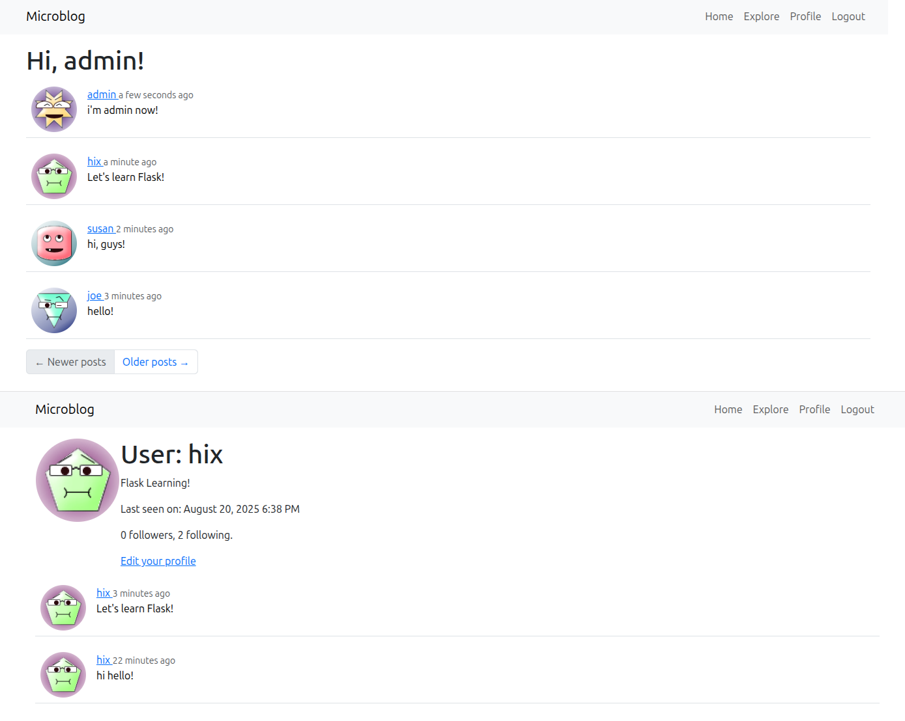

### Microblog от автора 



##### Приложение включает следующие функции:
- регистрация пользователей
- вход/выход
- сброс пароля пользователя
- редактирование профиля
- отправка и просмотр постов
- подписки

Запуск
```bash
FLASK_APP=microblog.py
FLASK_DEBUG=0
flask run
```

Используемые пакеты в requirements.txt
```bash
pip install -r requirements.txt
```

Для теста отправки на email (ошибки сервиса - отправка письма админу, сообщения пользователям о паролях, сброс и пр.) в отдельном терминале
```bash
aiosmtpd -n -c aiosmtpd.handlers.Debugging -l localhost:8025
```
